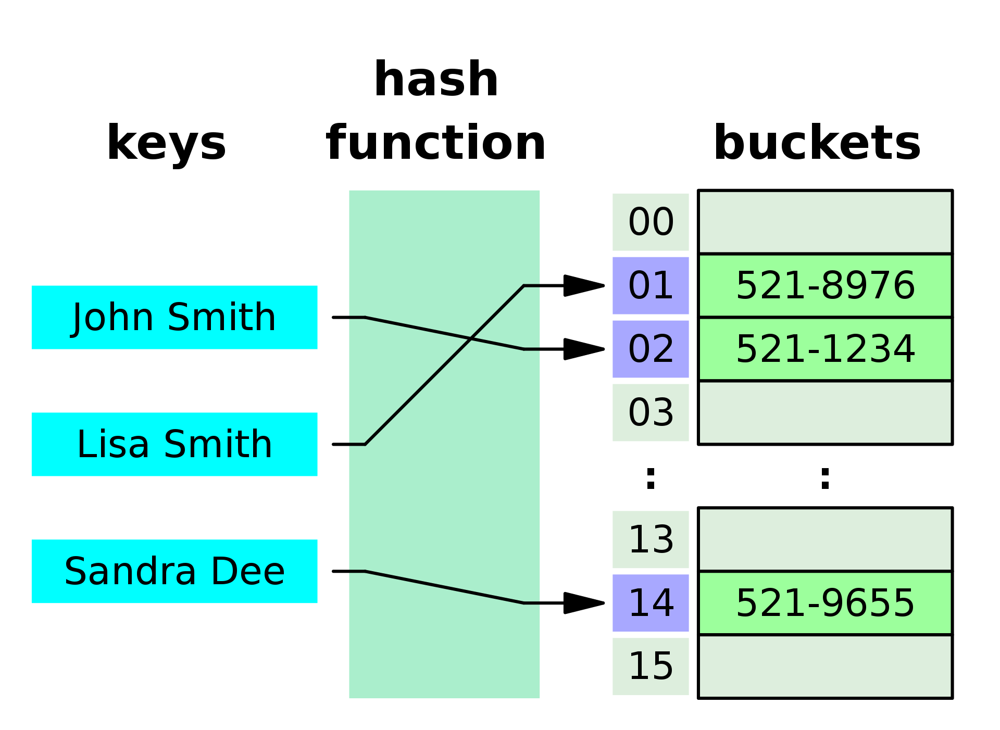

### What is hashing?

Hashing is a process of transforming input data (such as text, files, or binary data) into a fixed-size output value called a hash. This output value is usually a unique representation of the input data and is often a fixed-length string of characters, typically represented in hexadecimal format.

Hashing is commonly used in computer science for various purposes, such as data integrity checking, password storage, digital signatures, and message authentication codes (MACs). Hash functions are designed to be deterministic, meaning that the same input will always produce the same output, and they are generally irreversible, meaning that it is practically impossible to derive the original input from the output hash value.

One of the key properties of a good hash function is that it should be computationally difficult to find two different inputs that produce the same output hash value. This property is known as collision resistance, and it is important for ensuring the security and reliability of various applications that rely on hash functions.

### What is a hash table?

A hash table is a data structure that uses a hash function to map keys to their associated values, allowing for efficient lookup, insertion, and deletion of key-value pairs.

A hash function takes an input key and computes a fixed-size output value, which is used as an index into an array or bucket of the hash table. The key-value pair is then stored at the computed index. When searching for a particular key, the hash function is applied to the key to compute its index, and the associated value can be retrieved from the corresponding bucket in constant time.

The performance of a hash table depends on the quality of the hash function, which should distribute keys evenly across the array to minimize collisions and avoid long chains of keys in the same bucket. Hash tables are commonly used in programming languages and databases to implement associative arrays, sets, and dictionaries. They are often preferred over other data structures such as arrays or linked lists for their fast average-case performance for key lookups, insertions, and deletions.

### What is a hashing collision?

A hashing collision occurs when two or more different keys are mapped to the same index in a hash table by the hash function.

When a collision occurs, it means that multiple keys are trying to occupy the same position in the array or bucket of the hash table. This can lead to a situation where two or more key-value pairs are stored in the same location, making it difficult to retrieve the correct value when searching for a particular key.

There are different ways to handle collisions in a hash table. One common approach is to use a linked list at each index to store all the key-value pairs that hash to that index. This is called separate chaining. Another approach is to use open addressing, where the hash function is used to probe for an empty location in the array when a collision occurs, and the key-value pair is stored in the first available empty position.

The handling of collisions is an important consideration when designing a hash table and implementing a hash function. A good hash function should minimize collisions and distribute the keys as evenly as possible across the hash table to ensure good performance.

### What is the significance of the initial capacity and load factor of a hash table?

The load factor and initial capacity are two important parameters that determine the size and performance of a hash table.

The load factor is the ratio of the number of key-value pairs stored in the hash table to the number of buckets in the hash table. It represents how full the hash table is. A high load factor means that the hash table is more full, and collisions are more likely to occur. A low load factor means that the hash table has more empty buckets, and there is more space for new key-value pairs.

The initial capacity, on the other hand, is the number of buckets that the hash table is created with. It determines the initial size of the array used to store the key-value pairs. A higher initial capacity means that the hash table has more buckets, which can reduce the likelihood of collisions when the hash table is first created.

The load factor and initial capacity are both important factors that affect the performance of a hash table. A low load factor and a high initial capacity can improve the performance of the hash table by reducing collisions and the need for rehashing. However, a high initial capacity may waste memory if the hash table is not expected to store many key-value pairs, while a low initial capacity may require frequent rehashing if the hash table needs to store many key-value pairs.

In general, it is important to choose appropriate values for the load factor and initial capacity based on the expected usage and size of the hash table.